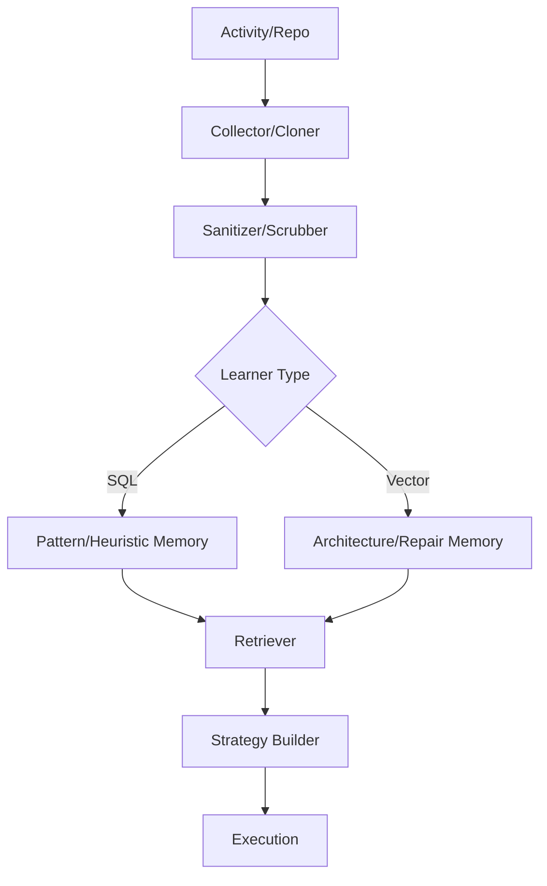

# 🧠 Mini Jules: Master Documentation (v15)

## Executive Summary
**Mini Jules** is an autonomous AI engineering agent designed to architect, write, and assemble multi-file software projects. It leverages a hierarchical planning system, a persistent "Engineering Brain," and a "Reality Learning Engine" to improve its performance through experience.

*   **Status:** V14 Hardened (Production Beta)
*   **Intelligence Score:** 87.5/100
*   **Core Loop:** Plan → Generate → Sandbox → Critique → Repair → Apply

---

## Core Purpose
Primary mission is the autonomous creation and maintenance of production-grade codebases with safety-first sandbox verification and persistent architectural memory.

---

## Capability Matrix

| Capability | Status | Confidence | Description |
|------------|---------|------------|-------------|
| **Multi-file generation** | Stable | 95% | Creation of complex stage-based project structures. |
| **Repository learning** | Stable | 90% | Extracting architectural DNA from GitHub repositories. |
| **Self repair** | Stable | 90% | Autonomous correction of syntax and import errors. |
| **Architecture synthesis**| Beta | 75% | Merging patterns from multiple source repositories. |
| **VS Code integration** | Stable | 95% | Sidebar UI, CodeLens actions, and bridge commands. |
| **Cross-repo reasoning** | Beta | 70% | Using external knowledge cards to guide new designs. |
| **Multi-lang support** | Alpha | 40% | Patterns for JS, TS, Go, Rust (Python is primary). |

---

## System Architecture

### Learning Pipeline

### High-Level Flow
Goal → **Repository Brain** → **Architecture Intelligence** → **Strategy Document** → **Generation** → **Sandbox** → **Critique** → **Repair** → **Validation** → **Apply**.

---

## Major Components

### 🏗️ Orchestrator (`project_creator/core/orchestrator.py`)
Central authority. Manages global state and coordinates specialized sub-coordinators (`GenerationCoordinator`, `ExecutionCoordinator`).

### 🛡️ ValidationManager & Sandbox (`project_creator/core/validation.py`)
Runs generated code in isolated `venv` directories with whitelisted commands and environment variable sanitization.

### 🛠️ Repair Engine (`project_creator/core/repair_strategist.py`)
Classifies errors (SYNTAX, IMPORT, LOGIC) and formulates multi-file repair plans using historical repair context.

---

## Repository Intelligence
The system learns from external repositories without storing source code.

*   **Workflow:** Clone (depth 1) → `ArchitectureExtractor` → `DependencyExtractor` → **Knowledge Card** → Store → Delete.
*   **Knowledge Card:** Structured JSON containing architecture style, folder structure, patterns (RAG, Agent, Auth), and complexity scores.
*   **Architecture Synthesis:** Merges patterns from multiple sources (e.g., OpenHands + CrewAI) into a cohesive recommendation.
*   **Architecture Consultant:** Generates `architecture_review.md` including tradeoff analysis (benefits, risks, costs).

---

## Learning & Memory System

### Memory Architecture
1.  **Relational (SQLite):** `~/.jules_memory.db`. Stores `patterns`, `snippets`, `heuristics`, `anti_patterns`.
2.  **Semantic (FAISS):** `.idx` files in memory directory. Stores high-dimensional embeddings for `architecture` and `repair` lookups.

### Intelligence Score Breakdown
The 0-100 score is a weighted aggregate of:
*   **Repair Success (30%)**: Percentage of sandbox errors fixed without human intervention.
*   **Architecture Quality (25%)**: Modularity and pattern alignment scores.
*   **Retrieval Precision (20%)**: Relevancy of retrieved patterns to current tasks.
*   **Pattern Reuse (15%)**: Frequency of successfully injected idiomatic code.
*   **Project Completion (10%)**: Ratio of successful builds to total attempts.

### Bias Prevention
Retrieval weights: **EXTERNAL (1.0)** vs **SELF (0.4)**. Prioritizes industry-standard patterns from open-source repositories over potentially flawed self-learned ones.

---

## Safety Model
*   **Sandbox Constitution:** strictly whitelisted bases (`pytest`, `ruff`, `python3`).
*   **Forbidden Patterns:** Blocks `sudo`, `rm -rf /`, `curl`, `eval`, and credential access (`.env`).
*   **Secret Scrubbing:** Automated regex-based removal of API keys and tokens before memory storage.

---

## Database Schema Overview

| Table | Purpose | Key Columns |
|-------|---------|-------------|
| `patterns` | Coding idioms | `pattern_type`, `content`, `frequency`, `source_type` |
| `snippets` | Reusable code | `file_path`, `content`, `status`, `source_type` |
| `heuristics`| High-level rules | `topic`, `heuristic`, `source_type` |
| `failures` | Anti-patterns | `type`, `error_msg`, `context_snippet` |
| `git_commits`| Style evolution | `hash`, `author`, `message`, `repo_path` |

---

## Limitations & Known Failure Modes
*   **Hallucinated Imports:** Occasionally attempts to import non-existent submodules.
*   **Package Versions:** May use outdated library syntax (e.g., Pydantic v1 vs v2).
*   **Over-Engineering:** Tendency to apply complex agent patterns to trivial CRUD tasks.
*   **Monorepo Scaling:** Struggles with analysis depth on repositories >1000 files.
*   **Logic Repairs:** While syntax is easily fixed, deep algorithmic bugs still require human review.

---

## Current State & Roadmap

### Current State
V14 Hardened. Core SDLC loop is verified. Architecture Intelligence is functional. VS Code bridge is stable.

### Next Priorities
*   **Architecture Benchmarking:** Structured testing of synthesized designs.
*   **Stronger Semantic Repair:** Using knowledge cards to guide logic fixes.
*   **Multi-Agent "War Gaming":** Agent vs Agent architectural stress testing.

### Long-Term Vision
**Jarvis Engineering Platform**: A fully autonomous engineering department for complex distributed systems.

---

## Troubleshooting & Common Commands

| Task | Command |
|------|---------|
| **Start Server** | `python3 project_creator/server.py` |
| **Run E2E Test** | `python3 examples/enhanced_workflow.py` |
| **Verify Learning**| `python3 project_creator/brain/generalized_experiment.py`|
| **Health Check** | `python3 -c "from project_creator.brain.health_monitor import HealthMonitor; HealthMonitor().generate_report()"` |

---

## Frequently Asked Questions
**Q: How does Jules learn?**
A: By observing your edits, git history, and analyzing top-tier open-source repositories.

**Q: Is it safe?**
A: Yes. All execution happens in an isolated sandbox with a strictly enforced command constitution.

**Q: Can I use it in VS Code?**
A: Yes, using the provided `mini-jules-vscode` extension which bridges to the local FastAPI server.

---
*Documentation Version: 15.0.0*
*Last Updated: 2025-05-15*
